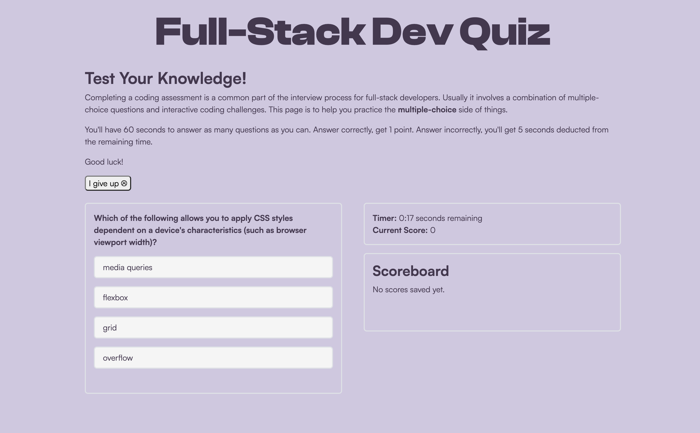

# Full-Stack Quiz
## Description
For this week's challenge, we were asked to create a quiz that mimics a code assessment that you might be given as part of an interview process. The quiz begins when the user clicks "Start the Quiz", and a timer begins a 60 second countdown. Five different questions are presented – if the user answers correctly, they receive 1 point. If they answer incorrectly, 5 seconds are deducted from the timer. At the end of the quiz, the user is able to save their score, which is stored using local storage.

The application can be accessed here: https://eileenmh.github.io/quiz-challenge/

The following image shows the web application's appearance and functionality:


## Acceptance Criteria
We were provided with the following acceptance criteria:
```
GIVEN I am taking a code quiz
WHEN I click the start button
THEN a timer starts and I am presented with a question
WHEN I answer a question
THEN I am presented with another question
WHEN I answer a question incorrectly
THEN time is subtracted from the clock
WHEN all questions are answered or the timer reaches 0
THEN the game is over
WHEN the game is over
THEN I can save my initials and score
```
## Built With
- HTML
- CSS
- Bootstrap
- Google Fonts
- JavaScript

## Credits
- Project prompt provided by [UNC Coding Bootcamp](https://bootcamp.unc.edu/coding/)
- Created by Eileen Harvey ([@eileenmh](https://github.com/eileenmh))
- Reset CSS provided by [meyerweb](https://meyerweb.com/eric/tools/css/reset/)
